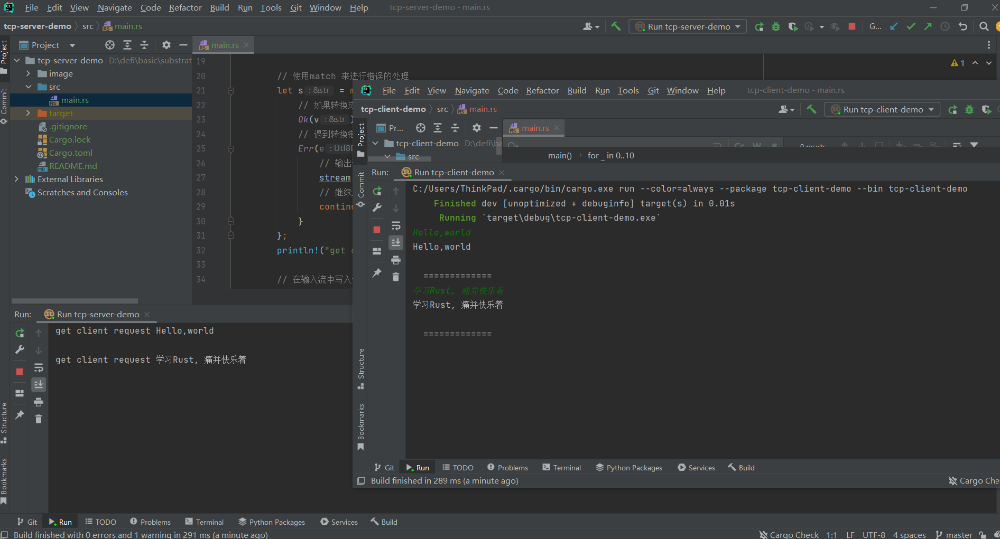
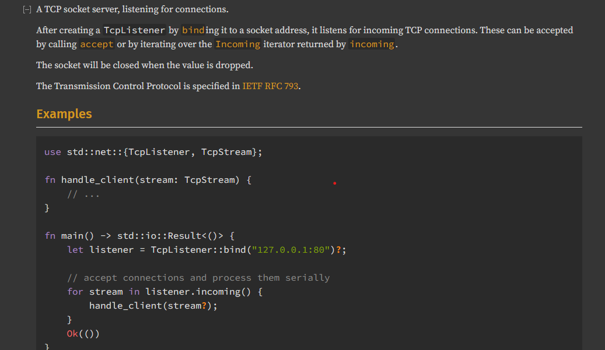

###  Q

 使用 Rust std 标准库的功能实现一个 tcp server，可参考网上代码自行修改，最终需要各位同学上传代码和运行结果的截图，可以直接附上代码链接。 要求： 

	*  1、能正常运行 
	*  2、对 tcp client（比如可用 telnet 等）发过来的消息，打印，并做 echo 返回 
	*  3、对代码每一句做注解 
	*  4、做一次标准的错误处理（模式匹配）

### A

建立Server 和Client 两个Cargo 工程，在服务器使用8080端口，客户端请求8080端口，服务器能够正常处理请求。

* 第一次传入数据 `Hello world`
* 第二次传入数据 `学习Rust, 痛并快乐着`

**代码运行结果的截图**

参照Rust 标准库[中的例子](https://doc.rust-lang.org/std/net/struct.TcpListener.html)

